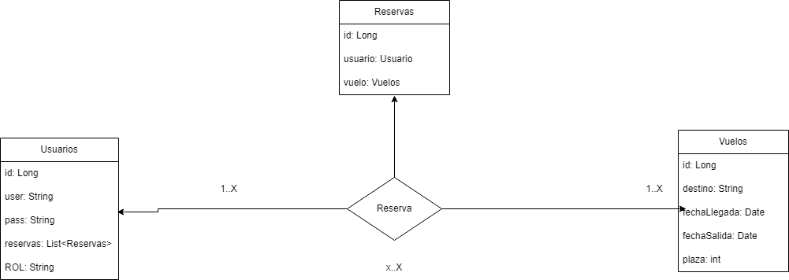

# **Viajando Ando**

## **Idea del proyecto**
La idea del proyecto es la creacion de una API que gestione las reservas de vuelos de una agencia de vuelos

## **Justificacion del proyecto**
El proyecto busca crear una API que centralice la gestión de vuelos, usuarios y reservas, mejorando la eficiencia y experiencia del cliente.

## **Descripcion de las tablas**



### **Tabla Usuario**
- Representa a los usuario en el sistema
- Propiedades:
  - `id`: Este campo es id unico de cada usuario
  - `user`: Este campo es el nombre de usuario con el que se identificara el usuario
  - `password`: Este campo es la contraseña con la que se identificara el usuario
  - `rol`: Este campo indicara el rol que presenta el usuario dentro de la aplicacion

```kotlin
data class Usuario(
    var id: Long? = null,
    var username: String,
    var password: String,
    var ROL: String
)
```

### **Tabla Reserva**
- Representa las reservas a sociadas a un usuario y vuelo
- Propiedades:
  - `id`: Este campo es el identificador de la reserva
  - `usuario`: Este campo es el usuario al que le pertenece la reserva
  - `vuelo`: Este campo es el vuelo que esta asiciado a la reserva

```kotlin
data class Reserva(
    var id: Long? = null,
    var usuario: Usuario,
    var vuelo: Vuelo
)
```
### **Tabla Vuelo**
- Representa los vuelos que pueden ser reservados
- Propiedades:
  - `id`: Este campo es el identificador del vuelo
  - `destino`: Este campo indica el lugar de destino del vuelo
  - `plazas`: Este campo indica el numero de plazas que quedan en el vuelo
  - `fechaSalida`: Este campo indica la fecha en la que el vuelo va a despegar
  - `horaSalida`: Este campo indica la hora en la que el vuelo va a despegar
  - `fechaLlegada`: Este campo indica la fecha en la que el vuelo va a aterrizar
  - `horaLlegada`: Este campo indica la hora en la que el vuelo va a aterrizar

```kotlin
data class Vuelo(
    var id: Long? = null,
    var destino: String,
    var plazas: Int,
    var fechaSalida: LocalDate,
    var horaSalida: LocalTime,
    var fechaLlegada: LocalDate,
    var horaLlegada: LocalTime
)
```
## **Endpoints para cada tabla**

### **Usuario**
- **POST** `/usuario/login` 
  - Lo usuarios accederan para iniciar sesion en el sistema
- **POST** `/usuario/register`  
  - Los usuarios accederan para registrarse en el sistema

### **Reserva**
- **GET** `/reserva`
  - Se obtendran todas las reservas del sistema
- **GET** `/reserva/{idReserva}`
  - Se obtendran las reservas con el mismo id
- **POST** `/reserva`
  - Se crearan nuevas reservas
- **PUT** `/reserva/{idReserva}`
  - Se modificara la reserva con el mismo id
- **DELETE** `/reserva/{idReserva}`
  - Se eliminara del sistema la reserva con el mismo id
### **Vuelo**
- **GET** `/vuelo`
  - Se obtendran todos los vuelos del sistema
- **GET** `/vuelo/{idVuelo}`
  - Se obtendran los vuelos con el mismo id
- **POST** `/vuelo`
  - Se crearan nuevos vuelos
- **PUT** `/vuelos/{idVuelos}`
  - Se modificara el vuelo con el mismo id
- **DELETE** `/vuelo/{idVuelo}`
  - Se eliminara del sistema el vuelo con el mismo id

## **Logica de negocio**
Como logica de negocio se van a serguir los siguientes puntos:
- Ninguno de los datos de los vuelos puede ser nulo
- Los vuelos que sean eliminados, eliminaran a su vez la reserva en el que este asociado
- Las contraseñas de los usuarios han de ser minimo de 8 caracteres y contener al menos un numero

## **Excepciones y codigos de estado**
Las excepciones y codigos de estados son:
- `ValidationException` - 400 Bad Request
- `ResourceNotFoundException` - 404 Not Found

## **Restricciones de seguridad**

- Los usuarios no autenticados solo podran acceder a las rutas de registro e inicio de sesion
- Los usuarios que esten registrados
  - Si su rol es user:
    - Podra acceder solo a las reservas a las que este asociado
    - Podran crear reservas
    - Podra modificar las reservas a las que este asociado
    - Podra eliminar las reservas a las que este asociado
    - Podra ver todos los vuelos existentes
  - Si su rol es admin:
    - Podra ver todas las reservas
    - Podra crear reservas
    - Podra modificar cualquier reservas
    - Podra elimincar cualquier reserva
    - Podra ver todos los vuelos
    - Podra crear vuelos
    - Podra modificar cualquier vuelo
    - Podra eliminar cualquier vuelo
